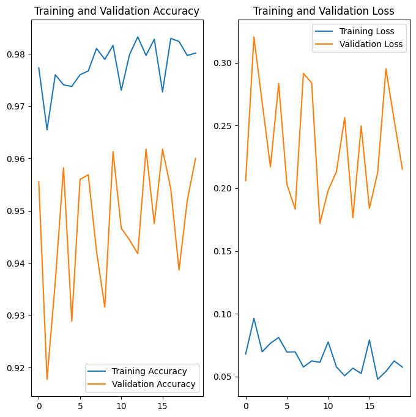
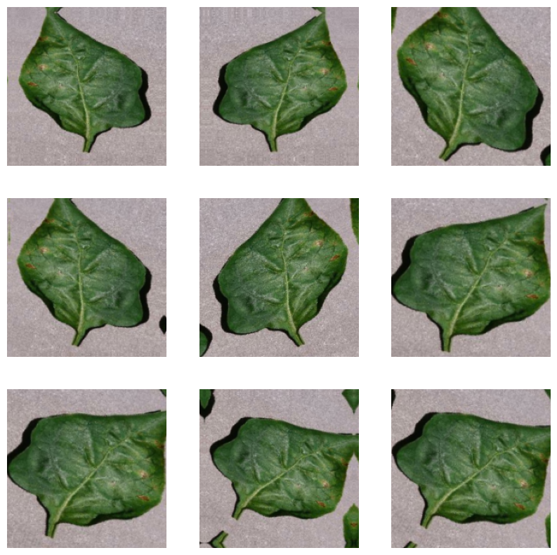

# PlantVillage Disease Detection
## Overview
This project demonstrates a complete workflow for training and evaluating a deep learning model to detect diseases in pepper, tomato, and potato plants using the PlantVillage dataset. The model is built using Convolutional Neural Networks (CNNs), leveraging TensorFlow and Keras. The dataset consists of labeled images for various plant diseases, including healthy plants.

## Project Structure
- **Data Directory**: Contains images organized in subdirectories for each class.
- **Training and Validation**: Splits data into training and validation sets.
- **Model Building**: Constructs a CNN model and trains it with augmented data.
- **Evaluation**: Evaluates the model and plots training and validation metrics.
- **Prediction**: Loads new images and predicts their classes using the trained model.

## Training and validation accuracy 

## Sample of Dataset

